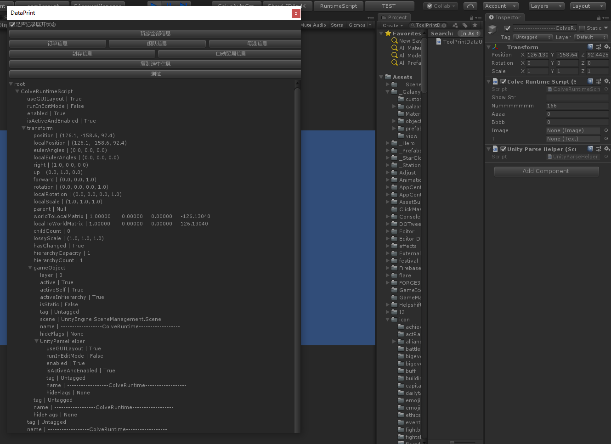

# UnityDataPrinter
unity 数据打印工具

支持MonoBehaviour类型 字典类型

1.通过ToolPrintDataUtil.PrintData 将数据转换成树数据
2.在ToolPrintDataWindow OnGUI中 调用setdata 传入树数据 即可成功展示

例：传入一个脚本后，可展示该脚本所有数据，挂载脚本的物体的所有数据既物体上其他脚本的所有数据。

